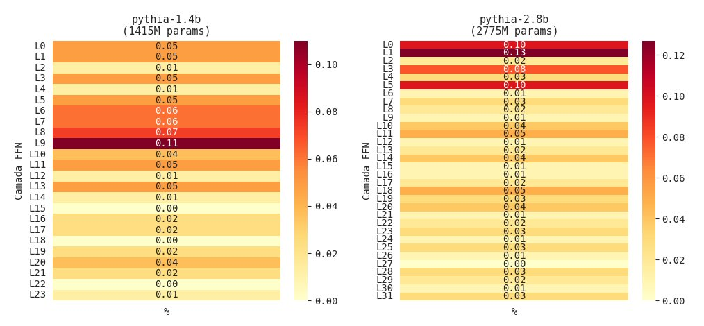
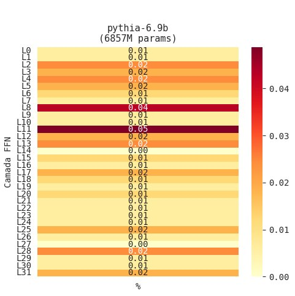

# H-Neurons in Small-Scale Language Models: Investigating the Existence of Hallucination-Associated Neurons in the Pythia Family

**Charles Cavalcante Alcarde · Luis Felipe da Silva Carlos Pereira · Pedro Henrique Guerra**  
Department of Computer Engineering and Automation (DCA)  
School of Electrical and Computer Engineering (FEEC)  
University of Campinas (UNICAMP) · Campinas, SP, Brazil · June 2026

---

## Abstract

This work investigates the existence of hallucination-associated neurons (H-Neurons) across the entire Pythia family (EleutherAI), extending the methodology proposed by Gao et al. (2025) — originally validated only on models with 7B to 70B parameters — to models ranging from 70M to 6.9B parameters. Using a pipeline based on the CETT metric (Contribution to Estimated Token Trajectory) and sparse L1-regularized logistic regression, we identified H-Neurons in all seven evaluated models (pythia-70m, pythia-160m, pythia-410m, pythia-1b, pythia-1.4b, pythia-2.8b, and pythia-6.9b). The results confirm three central hypotheses: **(H1)** H-Neurons exist in small-scale models, with in-domain AUROC ranging from 0.71 to 0.92 in the methodologically most robust models; **(H2)** the discriminative power of H-Neurons tends to increase with scale, with a positive trend in the sequence 160M→410M→1.4B→2.8B; and **(H3)** H-Neurons generalize to domains unseen during classifier training (NQ-Open), with OOD AUROC between 0.80 and 0.90 in the main models. The sparsity of the phenomenon is consistent with the 0.1% threshold reported in the original paper: in all reliable models, H-Neurons represent less than 0.05% of total FFN neurons. A complementary finding reveals that H-Neuron concentration peaks occur predominantly between 30% and 45% of network depth, suggesting that the processing associated with hallucinatory behavior concentrates in the intermediate layers of the transformer, rather than in the final projection layers. These results suggest that the neural mechanism underlying hallucination is a structural property of the transformer architecture, emerging independently of model scale.

**Keywords:** LLM hallucinations; H-Neurons; transformer internal analysis; Pythia family; CETT; sparse logistic regression; TriviaQA; NQ-Open; model scaling.

---

## Table of Contents

1. [Introduction](#1-introduction)
2. [Theoretical Background](#2-theoretical-background)
3. [Methodology](#3-methodology)
4. [Results](#4-results)
5. [Discussion](#5-discussion)
6. [Conclusion](#6-conclusion)
7. [References](#7-references)

---

## 1. Introduction

Large language models (LLMs) have become central tools in modern artificial intelligence systems, demonstrating remarkable capabilities in natural language understanding and generation. However, a persistent challenge undermines their reliability in high-stakes applications: the hallucination phenomenon — the generation of fluent, syntactically coherent text that is factually incorrect or entirely fabricated. The problem transcends model generations: estimates indicate that GPT-3.5 hallucinates in approximately 40% of citation-based factuality evaluations, a figure that remains high at 28.6% for GPT-4 (Chelli et al., 2024). State-of-the-art reasoning systems, such as DeepSeek-R1, despite remarkable performance on complex tasks, continue to exhibit pronounced hallucination modes (Bao et al., 2025). High-confidence hallucinations — scenarios in which the model appears certain while being wrong — constitute the most dangerous case, as entropy-based or calibration-based metrics fail to detect them reliably.

Gao et al. (2025) proposed a pioneering approach: investigating hallucinations from the inside out, identifying specific neurons in the feedforward networks (FFN) of LLMs whose activations reliably predict whether the model will hallucinate. These neurons, termed H-Neurons, constitute less than 0.1% of total neurons and demonstrate generalization capability to domains unseen during classifier training. However, the original study was restricted to models with 7B to 70B parameters, leaving open a fundamental question: do H-Neurons exist in small-scale models, or are they an emergent phenomenon exclusive to large-scale models?

The present work fills this gap using the Pythia family (Biderman et al., 2023) — models trained on the same data, in the same order, and with the same base architecture, varying only in scale. We evaluated seven models from 70M to 6.9B parameters, investigating three central research questions:

> **Central thesis:** H-Neurons emerge in small-scale language models, suggesting that the neural mechanism associated with hallucinations is fundamental to the transformer architecture and not exclusive to large-scale models.

**Research contributions:**
- **(H1)** Do H-Neurons exist in small-scale models? We investigate whether the phenomenon identified by Gao et al. (2025) in 7B–70B models also emerges in models from 70M to 6.9B parameters.
- **(H2)** Is there a scalability trend in the number and discriminative power of H-Neurons? We analyze whether the classifier AUROC and the absolute number of H-Neurons grow systematically with model size.
- **(H3)** Do H-Neurons identified on TriviaQA transfer to NQ-Open (out-of-distribution generalization)? We evaluate whether H-Neurons capture generalizable hallucination patterns, independent of the classifier's training domain.

The remainder of this paper is organized as follows: Section 2 presents the theoretical background, covering LLM hallucinations, the H-Neurons framework, the Pythia family, and the CETT metric. Section 3 describes the experimental methodology. Section 4 presents quantitative results for the three hypotheses. Section 5 discusses theoretical and practical implications, caveats, and methodological contributions. Section 6 concludes with future directions.

---

## 2. Theoretical Background

### 2.1 Hallucinations in Language Models

Hallucinations in LLMs can be formally defined as the phenomenon in which the model assigns higher probability $P_\theta(y|x)$ to a factually incorrect sequence than to the correct one, optimizing fluency at the expense of factuality. The consolidated taxonomy distinguishes two main axes (Huang et al., 2024): (i) intrinsic hallucinations, which contradict the reference source, and extrinsic hallucinations, which add unverifiable information; (ii) factual hallucinations, which diverge from real-world facts, and faithfulness hallucinations, which diverge from the input context.

The causes of hallucinations permeate all phases of the LLM lifecycle: noisy training data, the next-token prediction objective blind to factuality, RLHF that may prioritize compliance over truth, and latent uncertainties amplified during inference. Mitigation strategies organize into six categories (MDPI Survey, 2025): training and learning (SFT, RLHF, knowledge editing); architectural modifications (RAG, enhanced attention); prompt optimization (CoT, self-consistency, few-shot); post-generation control (fact-checking, LLM-as-judge); interpretability and diagnosis; and agents and orchestration. The present work falls within the interpretability and diagnosis category.

### 2.2 H-Neurons and Internal Transformer Analysis

The study by Gao et al. (2025) organized around three research questions: **(Q1)** Do H-Neurons exist in LLMs?; **(Q2)** What is their behavioral impact?; and **(Q3)** What is their origin? The identification methodology relies on three steps: (i) constructing a balanced contrastive dataset of correct and incorrect responses via TriviaQA; (ii) quantifying each neuron's contribution using the CETT metric; and (iii) training a sparse L1 classifier to identify neurons with the highest discriminative power.

Beyond existence (Q1), amplifying H-Neurons systematically increases over-compliance behaviors — acceptance of invalid premises, susceptibility to misleading contexts, adherence to harmful instructions (Q2). Cross-model transfer experiments demonstrated that H-Neurons emerge during pre-training and persist after instruction fine-tuning (Q3).

### 2.3 The Pythia Family

The Pythia family (Biderman et al., 2023) was developed by EleutherAI for interpretability research. All models share: (i) the same training corpus (The Pile) in the same data order; (ii) the same decoder-only transformer architecture with Gated MLP FFN blocks; and (iii) public intermediate training checkpoints. The internal architecture follows the pattern:

1. **Multi-Head Self-Attention layer** — captures contextual dependencies between tokens
2. **Gated MLP FFN** — projects the hidden representation to an intermediate space of dimension $d_m$ via $W_{gate}, W_{up} \in \mathbb{R}^{d_m \times d}$, applies SiLU activation, and projects back via $W_{down} \in \mathbb{R}^{d \times d_m}$

**Table 1 — Architectural dimensions of the Pythia family.**

| Model | n_layers | d | dm | N_FFN |
|:---|:---:|:---:|:---:|---:|
| pythia-70m | 6 | 512 | 2,048 | 12,288 |
| pythia-160m | 12 | 768 | 3,072 | 36,864 |
| pythia-410m | 24 | 1,024 | 4,096 | 98,304 |
| pythia-1b | 16 | 2,048 | 8,192 | 131,072 |
| pythia-1.4b | 24 | 2,048 | 8,192 | 196,608 |
| pythia-2.8b | 32 | 2,560 | 10,240 | 327,680 |
| pythia-6.9b | 32 | 4,096 | 16,384 | 524,288 |

*`n_layers`: number of FFN layers; `d`: hidden state dimension; `dm`: intermediate FFN dimension (`intermediate_size`); `N_FFN`: total FFN neurons = `n_layers` × `dm`.*

### 2.4 CETT Metric and Sparse L1 Classifier

The CETT metric (Contribution to Estimated Token Trajectory), proposed by Zhang et al. (2024), quantifies the causal contribution of an individual neuron to the FFN hidden state during the forward pass. At token $t$, the hidden representation $x_t \in \mathbb{R}^d$ is projected to the FFN intermediate space by:

$$z_t = \sigma(W_{gate} \cdot x_t) \odot W_{up} \cdot x_t$$

where $\sigma(\cdot)$ denotes the SiLU activation function; $d$ is the number of neurons in the transformer hidden layer; $d_m$ is the FFN intermediate space dimension (see Table 1); $w$ represents the learned weights of the projection matrices; and $t$ refers to the current token in the input sequence. The CETT metric normalizes each neuron's contribution:

$$CETT_{j,t} = \frac{\|h_t^{(j)}\|_2}{\|h_t\|_2}$$

CETT scores are aggregated by averaging over response tokens, producing a feature vector $X_i \in \mathbb{R}^N$ per example. The sparse L1 classifier predicts whether a response is hallucinated ($y=1$) or faithful ($y=0$). Neurons with positive non-zero weight ($w_j > 0$) are the H-Neurons.

---

## 3. Methodology

### 3.1 Models and Justification

We evaluated seven Pythia models to cover three orders of magnitude of scale. Models up to 1B were run on CPU with float32 precision; larger models on T4 GPU with 8-bit quantization (bitsandbytes).

### 3.2 Contrastive Dataset Construction

Following Gao et al. (2025), we constructed a balanced contrastive dataset using TriviaQA (Joshi et al., 2017). For each model, responses were generated using greedy decoding (`do_sample=False`) and classified as correct (label 0) or incorrect (label 1). The final dataset contains 100 balanced examples per model (50 correct + 50 incorrect), obtained after scanning up to 18,000 questions.

**Sampling strategy by model size:**

| Models | Regime | Threshold | Notes |
|:---|:---:|:---:|:---|
| < 1.4B params | n=1 | 1/1 | High error rates make multi-attempt infeasible |
| ≥ 1.4B params | n=10 | 8/10 | Early stopping after 3 consecutive failures |

As base models without instruction-tuning, Pythia models require few-shot prompting with 5 demonstrative examples in the format `"Question: [question]\nShort answer: [answer]"`.

For OOD evaluation, a complementary NQ-Open dataset (Kwiatkowski et al., 2019) was constructed with 15 correct + 15 incorrect examples per model, following the same sampling strategy. The normalizer (scaler) was kept fixed — fitted exclusively on TriviaQA.

**Pipeline configuration:**

| Parameter | Value | Description |
|:---|:---:|:---|
| `n_target_correct` | 50 | Target correct examples |
| `n_target_incorrect` | 50 | Target incorrect examples |
| `max_questions_to_scan` | 18,000 | Maximum questions scanned |
| `max_new_tokens` | 16 | Max tokens per response |
| `max_response_words` | 10 | Max words per response |
| `max_response_chars` | 100 | Max characters per response |
| `temperature` | 1.0 | Generation temperature (≥ 1.4B) |
| `top_k` | 50 | Top-k sampling (≥ 1.4B) |
| `top_p` | 0.9 | Top-p sampling (≥ 1.4B) |
| `C_grid` | [0.001–1.0] | L1 regularization grid |
| `test_size` | 0.2 | Train/validation split |

### 3.3 FFN Activation Extraction

For each example, we performed a forward pass and captured intermediate FFN activations at response tokens using PyTorch forward hooks registered at `dense_h_to_4h` (or equivalent). Activations are averaged over response tokens, producing a tensor of dimension (`n_layers` × `intermediate_size`) per example.

**Table 2 — Activation tensor dimensions per model.**

| Model | n_layers | intermediate_size | Total values/example |
|:---|:---:|:---:|---:|
| pythia-70m | 6 | 2,048 | 12,288 |
| pythia-160m | 12 | 3,072 | 36,864 |
| pythia-410m | 24 | 4,096 | 98,304 |
| pythia-1b | 16 | 8,192 | 131,072 |
| pythia-1.4b | 24 | 8,192 | 196,608 |
| pythia-2.8b | 32 | 10,240 | 327,680 |
| pythia-6.9b | 32 | 16,384 | 524,288 |

### 3.4 CETT Normalization and Feature Construction

Raw activations are transformed into CETT scores:

$$CETT_{i,\ell,j} = \frac{|\bar{z}_{i,\ell,j}|}{\|\bar{z}_{i,\ell}\|_2}$$

where z̄ᵢ,ₗ,ⱼ is the average activation of neuron j in layer ℓ for example i, and ‖z̄ᵢ,ₗ‖₂ is the L2 norm of layer ℓ. The final feature vector Xᵢ ∈ ℝᴺ concatenates CETT scores of all layers and neurons.

### 3.5 H-Neuron Identification via Sparse L1 Classifier

An L1-regularized logistic regression predicts the binary label (hallucinated/faithful). The regularization strength $C \in \{0.001, 0.005, 0.01, 0.05, 0.1, 0.5, 1.0\}$ is selected via grid search (80/20 stratified split). H-Neurons are defined as:

$$\mathcal{H} = \{ j : w_j > 0 \} \qquad \%H = \frac{|\mathcal{H}|}{N_{total}} \times 100\%$$

### 3.6 Statistical Baseline and Significance

A baseline of 1,000 random neuron draws was implemented. The empirical p-value is:

$$p = \frac{\text{card}\{AUROC_{rand} > AUROC_{\mathcal{H}}\}}{1000}$$

Results with $p < 0.05$ are considered statistically significant.

### 3.7 Experimental Challenges and Methodological Adaptations

- **Pythia-6.9B:** loaded on T4 GPU with 8-bit quantization (bitsandbytes), with selective CPU offloading
- **Models ≤ 1B:** inference on CPU with float32 precision (~4s/question)
- **Generation regime:** greedy decoding for models < 1.4B; multiple sampling (n=10, threshold=8) for larger models
- **Adaptation vs. original paper:** threshold=8/10 instead of 10/10 — documented as a methodological limitation

---

## 4. Results

### 4.1 Comparative Overview

**Table 3 — Comparative results of H-Neurons in the Pythia family.** ⚠ indicates models with methodological caveats.

| Model | Params | H-Neur. | % Total | Acc H | Acc Rand | AUROC H | AUROC OOD |
|:---|---:|---:|---:|:---:|:---:|:---:|:---:|
| pythia-70m ⚠ | 70M | 11 | 0.0895% | 0.85 | 0.6626 | 0.92 | 0.50 |
| pythia-160m | 162M | 18 | 0.0488% | 0.60 | 0.5596 | 0.71 | 0.72 |
| pythia-410m | 405M | 22 | 0.0224% | 0.75 | 0.5648 | 0.80 | 0.84 |
| pythia-1b ⚠ | 1,012M | 3 | 0.0023% | 0.75 | 0.5325 | 0.82 | 0.80 |
| pythia-1.4b | 1,415M | 68 | 0.0346% | 0.85 | 0.6049 | 0.90 | 0.84 |
| pythia-2.8b | 2,775M | 105 | 0.0320% | 0.90 | 0.5938 | 0.92 | 0.90 |
| pythia-6.9b | 6,857M | 71 | 0.0135% | 0.75 | 0.5951 | 0.85 | 0.80 |

### 4.2 Hypothesis H1 — Existence in Small-Scale Models

H1 is confirmed in all seven evaluated models: the H-Neuron classifier consistently outperforms the random baseline across the entire family.

*Figure 1 — H-Neurons vs. random neurons (baseline) in the Pythia family.*

**Table 4 — Empirical p-values of AUROC** (1,000 random draws baseline). Bold: $p < 0.05$. ✓: confirmed statistical significance.

| Model | AUROC in-domain | p-value in-domain | AUROC OOD | p-value OOD | Significance |
|:---|:---:|:---:|:---:|:---:|:---:|
| pythia-70m ⚠ | 0.92 | 0.086 | 0.50 | 0.679 | — |
| pythia-160m | 0.71 | 0.442 | 0.72 | 0.063 | — |
| pythia-410m | 0.80 | 0.065 | 0.84 | **0.008** | OOD ✓ |
| pythia-1b ⚠ | 0.82 | 0.033 | 0.80 | 0.021 | OOD ✓ |
| pythia-1.4b | 0.90 | **0.015** | 0.84 | **0.010** | both ✓ |
| pythia-2.8b | 0.92 | **0.002** | 0.90 | **0.003** | both ✓ |
| pythia-6.9b | 0.85 | 0.124 | 0.80 | **0.022** | OOD ✓ |

### 4.3 Hypothesis H2 — Scale Dependency

Excluding models with caveats, a clear positive trend is observed: 160M (0.71) → 410M (0.80) → 1.4B (0.90) → 2.8B (0.92), with a slight retraction at 6.9B (0.85). The pythia-1b is an outlier at the boundary between the two sampling strategies, resulting in only 3 H-Neurons.

*Figure 2 — H-Neuron sparsity by model scale.*

**Table 5 — H-Neuron scalability** (models with caveats excluded from trend analysis).

| Model | Params | H-Neurons | % Total | AUROC in-domain | H2 Trend |
|:---|---:|---:|---:|:---:|:---:|
| pythia-160m | 162M | 18 | 0.0488% | 0.71 | ↗ base |
| pythia-410m | 405M | 22 | 0.0224% | 0.80 | ↗ |
| pythia-1b ⚠ | 1,012M | 3 | 0.0023% | 0.82 | ⚠ outlier |
| pythia-1.4b | 1,415M | 68 | 0.0346% | 0.90 | ↗ |
| pythia-2.8b | 2,775M | 105 | 0.0320% | 0.92 | ↗ peak |
| pythia-6.9b | 6,857M | 71 | 0.0135% | 0.85 | ↘ retraction |

### 4.4 Hypothesis H3 — Out-of-Distribution Generalization

H3 is confirmed with statistical significance: OOD AUROC on NQ-Open ranges from 0.80 to 0.90 in reliable models (pythia-410m: 0.84; pythia-1.4b: 0.84; pythia-2.8b: 0.90; pythia-6.9b: 0.80), with p-values below 0.05. The NQ-Open dataset followed the same sampling strategy as TriviaQA: regime 1/1 for models below 1.4B and regime 10/10 (threshold 8) for larger models.

### 4.5 H-Neuron Distribution Across FFN Layers

In pythia-410m, pythia-1.4b, and pythia-6.9b, H-Neuron concentration peaks occur between 30% and 45% of network depth — a region associated with factual knowledge retrieval.

*Figure 3a — H-Neuron distribution: pythia-70m and pythia-160m. ⚠ pythia-70m results should be interpreted with caution.*

*Figure 3b — H-Neuron distribution: pythia-410m (peaks at L8 and L11, 33–46% of depth) and pythia-1b (only 3 H-Neurons ⚠).*

*Figure 3c — H-Neuron distribution: pythia-1.4b (peak at L9, 37.5% of depth) and pythia-2.8b (atypical peak at L1).*

*Figure 3d — H-Neuron distribution: pythia-6.9b (peaks at L8 and L11, 25–34% of depth).*

---

## 5. Discussion

### 5.1 Hypothesis Confirmation and Theoretical Implications

**H1** is robustly confirmed: H-Neurons exist in all evaluated models, including pythia-160m with only 162M parameters. This evidence supports the interpretation that H-Neurons constitute a structural property of the transformer architecture, emerging as a consequence of the next-token prediction objective regardless of model capacity.

**H2** is partially confirmed: the increasing AUROC trend (0.71 → 0.80 → 0.90 → 0.92) indicates that larger models develop H-Neurons with greater specificity. Observed oscillations are attributable to sample variance with 100 training examples.

**H3** is confirmed with statistical significance: H-Neurons identified in one domain retain predictive capability in distinct domains, suggesting they capture a fundamental property of hallucinatory behavior rather than domain-specific artifacts.

### 5.2 Complementary Finding: Functional Layer Organization

The convergence of H-Neuron peaks at 30–45% of network depth — observed independently in pythia-410m, pythia-1.4b, and pythia-6.9b — constitutes an unanticipated complementary finding. This is consistent with works by Geva et al. (2021) and Meng et al. (2022) associating intermediate FFN layers with factual knowledge storage and retrieval. This pattern was not explicitly reported by Gao et al. (2025).

### 5.3 H-Neurons as a Neural Thermometer: Correlation, Causality, and Practical Value

H-Neurons are correlates of hallucination, not its exclusive cause. The phenomenon is multicausal (training data, next-token prediction objective, RLHF, knowledge gaps). H-Neurons function as a **neural thermometer**: a measurable, localized signal that accompanies hallucinatory behavior — clinically useful, but not the infection itself.

The practical value of H-Neurons does not depend on resolving the underlying multicausality:

1. **Real-time detection:** H-Neuron activation patterns can signal hallucination risk during inference, before the response reaches the user, triggering RAG or fact-checker mechanisms.
2. **Partial intervention:** suppressing H-Neurons reduces over-compliance behaviors, with significant impact in high-stakes systems (medical diagnosis, legal advisory).
3. **Mapping for causal investigation:** precise neuron and layer coordinates enable investigation of why the signal emerges there — connecting H-Neurons to training dynamics and factual knowledge retrieval mechanisms.

> The diagnosis precedes the treatment: H-Neurons are the first step of a research program that may eventually lead to deeper causal interventions.

### 5.4 Caveats and Limitations

**pythia-70m ⚠:** accuracy near zero even with few-shot prompting. The contrastive dataset was constructed using the same methodology as all other models — always storing the model's own generated response (never external gold answers). The anomalously high AUROC (0.92) may reflect qualitative class imbalance due to very few correct examples available.

**pythia-1b ⚠:** potential dataset contamination from mixing generation regimes across distinct sessions. Only 3 H-Neurons identified; results treated as inconclusive.

**General limitations:** (i) 100 examples per model vs. 1,000 in the original paper; (ii) OOD dataset of only 30 examples; (iii) absence of causal perturbation experiments — results are correlational. The CETT is generated via forward pass with the concatenation `"Question: [question]\nShort answer: [answer]"`, the same format used during generation, ensuring context consistency.

### 5.5 Methodological Contributions

Three adaptations useful for replicating internal transformer analysis experiments in computationally restricted environments:

1. **Few-shot prompting** for base models on structured QA tasks — direct impact on accuracy rate and dataset viability
2. **Greedy decoding** as a valid substitute for stochastic consistency filtering when computational constraints make the original approach infeasible
3. **Empirical statistical baseline** with 1,000 random draws for significance without parametric assumptions about the null distribution

---

## 6. Conclusion

This work demonstrated that H-Neurons emerge across the entire Pythia family — including models with only 160M parameters — with sparsity consistently below 0.05% of total FFN neurons, compatible with the 0.1% threshold reported for models 44 times larger. This consistency across three orders of magnitude of scale suggests that H-Neurons constitute a structural property of the transformer architecture, not a large-scale emergent phenomenon.

The complementary finding on the concentration of H-Neurons in intermediate layers (30–45% of depth) adds a spatial dimension: hallucination is not processed uniformly across the network, but concentrates in a specific region associated with factual knowledge retrieval.

H-Neurons function, ultimately, as a **neural thermometer of hallucination**: a sparse, localized, and generalizable signal that accompanies hallucinatory behavior without being its exclusive cause. Their practical value lies in three complementary fronts — real-time detection during inference, surgical partial intervention, and mechanistic mapping that paves the way for future causal investigations. The multicausality of hallucination does not invalidate the thermometer; it only reminds us that it is not the antibiotic.

**Priority future directions:**
1. Causal perturbation experiments (activation scaling) in Pythia models to verify the over-compliance pattern
2. Cross-domain generalization evaluation (e.g., BioASQ)
3. Investigation of H-Neuron temporal evolution using Pythia's intermediate training checkpoints
4. Expansion of the contrastive dataset to 500–1,000 examples per model with stratified k-fold cross-validation

---

## 7. References

- Bao, F.; Xu, C.; Mendelevitch, O. DeepSeek-R1 hallucinates more than DeepSeek-v3. *Vectara Blog*, Jan. 2025.
- Biderman, S. et al. Pythia: A Suite for Analyzing Large Language Models Across Training and Scaling. *arXiv:2304.01373*, 2023.
- Chelli, M. et al. Hallucination rates and reference accuracy of ChatGPT and Bard for systematic reviews. *European Journal of Cardio-Thoracic Surgery*, v. 64, 2024.
- Gao, C. et al. H-Neurons: On the Existence, Impact, and Origin of Hallucination-Associated Neurons in LLMs. *arXiv:2512.01797*, 2025.
- Geva, M. et al. Transformer Feed-Forward Layers Are Key-Value Memories. In: *EMNLP*, 2021.
- Huang, L. et al. A Survey on Hallucination in Large Language Models: Principles, Taxonomy, Challenges, and Open Questions. *ACM Transactions on Information Systems*, 2024.
- Ji, Z. et al. LLM internal states reveal hallucination risk faced with a query. *arXiv:2407.03282*, 2024.
- Joshi, M. et al. TriviaQA: A Large Scale Distantly Supervised Challenge Dataset for Reading Comprehension. In: *ACL*, 2017.
- Kwiatkowski, T. et al. Natural Questions: A Benchmark for Question Answering Research. *Transactions of the Association for Computational Linguistics*, v. 7, 2019.
- Lindsey, J. et al. On the biology of a large language model. *Transformer Circuits Thread*, 2025.
- Meng, K. et al. Locating and Editing Factual Associations in GPT. *Advances in Neural Information Processing Systems (NeurIPS)*, 2022.
- MDPI Survey. From Illusion to Insight: A Taxonomic Survey of Hallucination Mitigation. *AI Systems*, v. 6, n. 10, 2025.
- Zhang, Z. et al. ReLU² Wins: Discovering Efficient Activation Functions for Sparse LLMs. *arXiv:2402.03804*, 2024.

---

*IA376N — Generative AI: from models to multimodal applications (2026.1)*  
*Prof. Paula Dornhofer Paro Costa · FEEC/UNICAMP*
